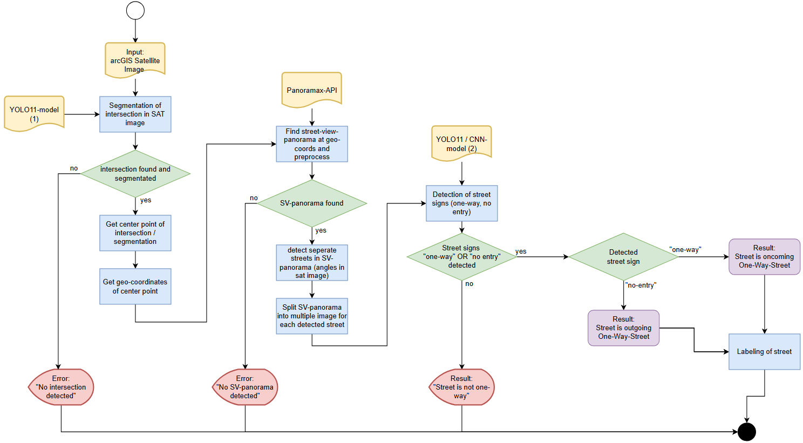

# AAIProject

## Description

Folder *"Part1_satelliteImages"* includes all work regarding the extraction, segmentation and preprocessing of satellite images. This includes calculating the center point of a detected and segmented intersection in a given satellite image. This represents part 1 of the solution flowchart (Image 1)

## Scripts and Notebooks

- Get coordinates of center point in intersection: dataset_caen/yolo/get_center_coords.ipynb
- Get Satellite images of intersections in Caen, France from Intersection Dataset (JSON): dataset_caen/Get_SatIMG_geoJSON.ipynb
- Train YOLO-model: dataset_caen/yolo/dataset/train_yolo.py
- Review YOLO-model quality: dataset_caen/yolo/dataset/runs/segment/train